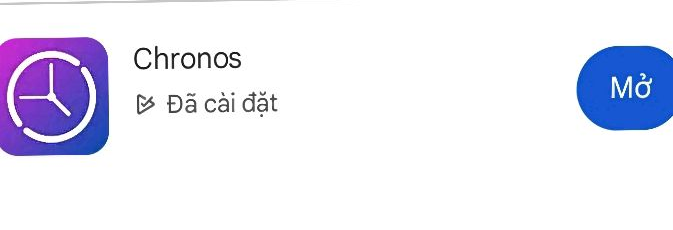

 
# Hướng dẫn sử dụng app Chronos trên Android

## 1. Cài đặt ứng dụng
- Truy cập Google Play Store trên điện thoại Android hoặc truy cập trực tiếp: [Tải Chronos trên Google Play](https://play.google.com/store/apps/details?id=com.fbiego.chronos)
- Tìm kiếm từ khóa "Chronos" nếu truy cập qua Play Store.
- Chọn ứng dụng Chronos của nhà phát triển FBiego, nhấn "Cài đặt" (Install).

## 2. Kết nối thiết bị
- Bật Bluetooth trên điện thoại.
- Trong ứng dụng Chronos, qua tab Đồng hồ
- Chọn đồng hồ thông minh của bạn từ danh sách thiết bị khả dụng. Nếu chưa thấy, nhấn "Quét lại" (Refresh).
- Nhấn vào tên thiết bị để kết nối. Xác nhận ghép đôi nếu được yêu cầu.
- Sau khi kết nối thành công, đồng hồ sẽ tự động đồng bộ dữ liệu với ứng dụng.

## 3. Cài đặt ban đầu
1. Qua tab Thông báo
2. Chọn mục Ứng dụng
3. Cấp quyền đọc thông báo cho Chronos
4. Vào lại mục Ứng dụng, tìm từ khóa *maps* và tích vào
5. Qua tab Đồng hồ
6. Lướt xuống dưới cùng, chọn Quản lý esp
7. Bật Cho phép chỉ đường

## 8. Một số lưu ý
- Luôn bật Bluetooth để đảm bảo kết nối liên tục.
- Nếu hiển thị giờ nhưng không hiển thị chỉ đường:
  1. Kiểm tra quyền Thông báo của Google Map
  2. Kiểm tra lại bước 3
  3. Qua tab Thông báo, tắt quyền đọc thông báo của Chronos và bật lại
  4. Nếu hiện dòng "Check Chronos setting, kiểm tra lại chỗ *Quản lý esp* ở bước 3
- Nếu gặp sự cố kết nối, hãy thử khởi động lại điện thoại hoặc đồng hồ.
- Đảm bảo ứng dụng Chronos luôn được cập nhật phiên bản mới nhất để nhận các tính năng và bản vá mới.

---
**Lưu ý:**

